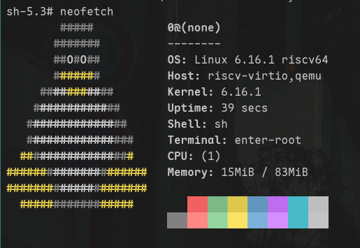

# elecleus 的试炼记录

## 基本信息

- GitHub ID: Elecleus
- 联系邮箱: Elecleus@outlook.com
- rootfs 发布 Repo: https://github.com/Elecleus/openRuyi-intern-submission

## Rootfs 资产

- 文件名: rootfs-riscv64-lfs-Elecleus.tar.zst
- SHA256: 1bdb854321517676e555d157b02640c4d813661b1dfaa17ee119e4c97af488b9

## 如何从 rootfs 运行起来

> 目标：从"下载 rootfs"到"进入环境的最短步骤。

### 方式 1

1. 解压并进入目录
2. 运行 `./run` 脚本
3. 进入 initramfs 后手动运行 `./enter-root` 脚本
4. 进入 rootfs 后运行 `neofetch`

<!-- 可选区 -->

## fastfetch / neofetch 证据

<!-- 此处插入你的 fastfetch 截图 -->

## 这是如何锻造的 (LFS 过程简述)

- 参考的教程/版本:
  - [Linux from Scratch 12.4][LFS]
  - [Linux on RISC-V using QEMU and BUSYBOX from scratch][RISC]
- 关键配置（toolchain / glibc / 内核 / init / busybox / 包策略等）:
  - **gcc 15.4**: No more than mentioned in [LFS][LFS]
  - **glibc 2.42**: No more than mentioned in [LFS][LFS]
  - **kernel 6.14.1**: No more than mentioned in [LFS][LFS]
  - **init**: No more than mentioned in [教程 2][RISC]
  - **busybox 1.37.0**: 根据报错信息删除了不兼容 rv64 架构的编译选项
- 与"原教旨 LFS"的偏离（如有）:
  1. **根据自己的理解把面向 x86 架构的 [LFS](LFS) “翻译”成 rv64 版**
  2. 使用 busybox 作为 initramfs
  3. 因为目标架构不是 x86, 不能在完成基础系统的搭建后 chroot 进入 rootfs 再继续进行下一步，选择了直接根据 [教程 2][RISC] 搭建完成 initramfs 并进入虚拟机<keng3>

## 你踩过的坑

- 坑 1: 如上 [与"原教旨 LFS"的偏离第二条](#keng3)
- 坑 2: `gcc` 使用相对目录定位 `cc1`, 需要 `-B` 选项手动指定一下<keng2>

## 已知问题 / TODO (如有)

- 如上 [坑 2](#keng2)
- 功能太少了
- initramfs 到 rootfs 的切换需要手动执行，`pivot_root` 也没成功

## 安全声明

- 我确认 rootfs 不包含任何密钥/Token/SSH Key/凭据/私人数据。

[LFS]: https://www.linuxfromscratch.org/lfs/downloads/stable/LFS-BOOK-12.4-NOCHUNKS.html
[RISC]: https://risc-v-machines.readthedocs.io/en/latest/linux/simple/