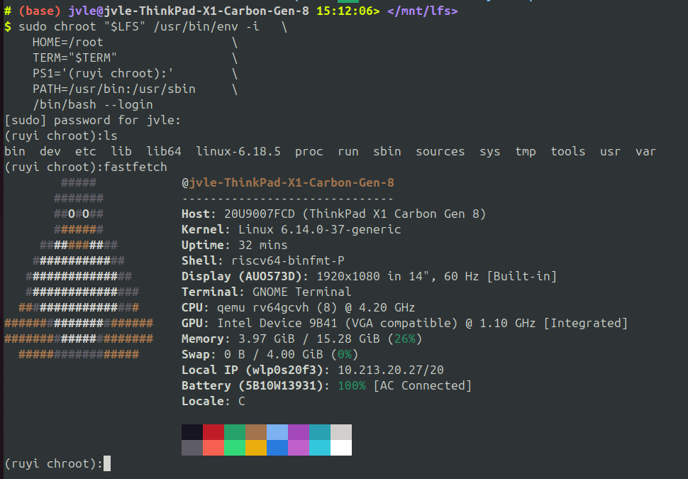
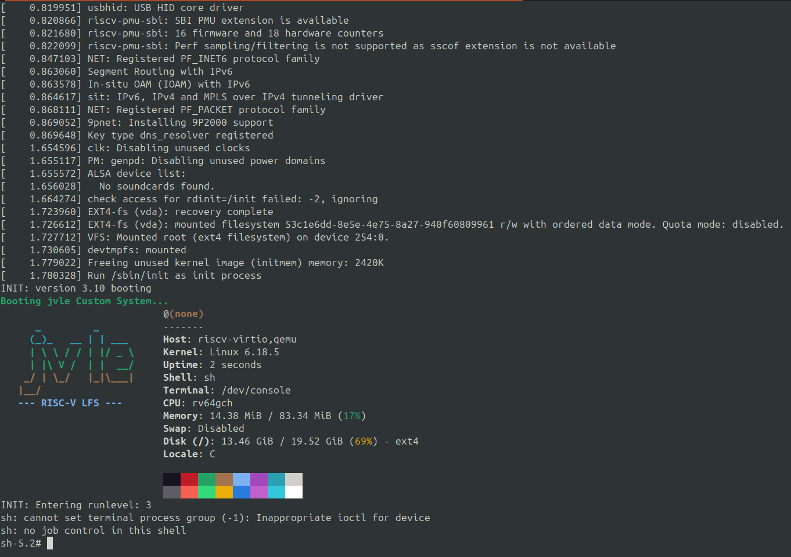

# Jvlegod 的试炼记录

## 基本信息

- GitHub ID: Jvlegod
- 联系邮箱: mingkeke5275@163.com
- rootfs 发布 Repo: https://github.com/Jvlegod/lfs-from-riscv

## Rootfs 资产

- 文件名: rootfs-riscv64-lfs-Jvlegod.tar.zst
- SHA256: 3fb55fbf8b43d6e3f6cdabfdb96ccc82a6c5047f4240283f85fe3fdcfb87090c

## 如何从 rootfs 运行起来

- 拉下kernel源码(6.18)
- 拉下 [lfs 软件包集合](https://ftp.osuosl.org/pub/lfs/lfs-packages/12.2/)
- 安装 binutils, linux-header, gcc, glibc, coreutils, util-linux, sysvinit, fastfetch 等
- 手动配置 rootfs 的基础文件, `etc/inittab`, `etc/profile`, `etc/fstab`
- 补齐目录结构, `dev`, `proc`, `sys`, `run`, `etc`, `var`, `tmp` 等
- 加入自己的 logo
- 启动
    - chroot 方式
    - qemu 方式

## fastfetch / neofetch 证据

### chroot

### qemu

## 这是如何锻造的 (LFS 过程简述)

一切都在 blog 中.

> http://47.108.130.26:4000/2026/01/14/lfs-from-riscv/

或者仓库的README.md

> https://github.com/Jvlegod/lfs-from-riscv

## 你踩过的坑

千万不要用 root 用户操作！！！
千万不要用 root 用户操作！！！
千万不要用 root 用户操作！！！

that's all.

## 安全声明

- 我确认 rootfs 不包含任何密钥/Token/SSH Key/凭据/私人数据.
